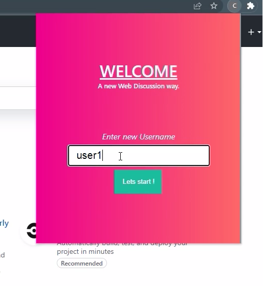
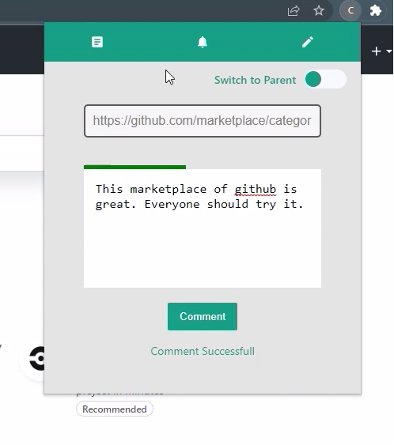
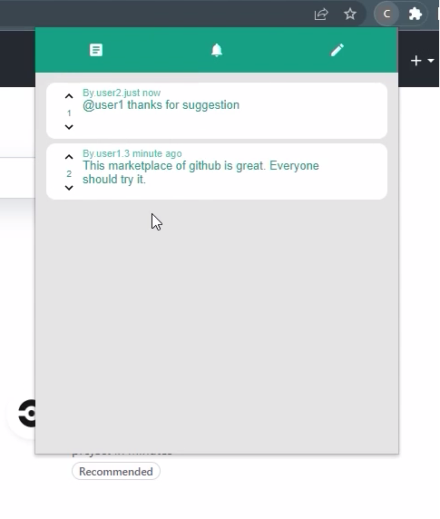
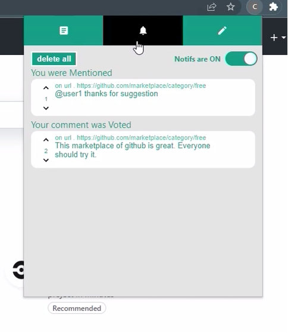

# CommentX

A Chrome extension to read and write comments on any web url. It is a complete discussion platform in form of extension. It allows mentions and notifications as well.

## Screenshots

## Files Structure -

React files are in [/src](https://github.com/amifunny/CommentX/tree/main/src) directory.

JS files converted from JSX are in [/main/popup/js](https://github.com/amifunny/CommentX/tree/main/main/popup/js) directory.

To load extension in developer mode in chrome browser, load unpacked [/main](https://github.com/amifunny/CommentX/tree/main/main) directory.

Database Structure is in [/db_schema](https://github.com/amifunny/CommentX/tree/main/db_schema) directory which could be imported to initialize a database on local MySQL server.

Backend of this application is written in Python, Flask. Server files are stored in [/server](https://github.com/amifunny/CommentX/tree/main/server/) directory. Use `flask run` to start a local server.
